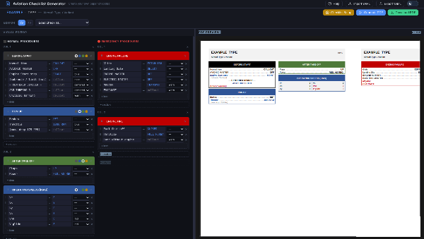

# Aviation Checklist Generator

A tool for creating print-ready **A4 landscape PDF checklists** — designed for laminated cockpit cards with a centre fold. Normal procedures on the left half, emergency procedures on the right. An optional walkaround checklist can occupy the rightmost column(s) of the right half.

**Live version: [checklists.helgenberger.net](https://checklists.helgenberger.net/)**

---

---

## Overview

| File / Directory | Description |
|---|---|
| `generate.py` | CLI tool: YAML → PDF |
| `server.py` | Flask HTTP backend: `POST /generate` → PDF, serves `./public/` and `./aircraft/` |
| `public/index.html` | Vue 3 web UI (single HTML file, no build step) |
| `requirements.txt` | Python dependencies |
| `Dockerfile` | Container image, non-root user, port 5000 |
| `compose.yml` | Docker Compose: checklist app + Caddy reverse proxy + deploy webhook |
| `aircraft/` | Example YAML checklists served via `/examples` API |
| `deploy/` | Webhook receiver + deploy script for auto-deploy on git push |

---

## Quick Start

### Docker Compose (production)

```bash
git clone https://github.com/helge000/checklists
cd checklists

# Create .env with your webhook secret
echo "WEBHOOK_SECRET=your_secret_here" > .env

docker compose -f compose.yml up -d
```

Open **https://checklists.helgenberger.net** — or your configured domain.

### Local dev (venv)

```bash
# System fonts (Debian / Ubuntu)
sudo apt install fonts-liberation fonts-dejavu-core fontconfig

# Python environment
python3 -m venv .venv
source .venv/bin/activate
pip install -r requirements.txt

# CLI — generate a PDF directly
python3 generate.py aircraft/deadx.yaml

# HTTP backend + UI
python3 server.py --host 0.0.0.0 --port 5000
# → http://localhost:5000
```

---

## Web UI Features

The web UI (`public/index.html`) is a single self-contained HTML file requiring no build step.

### Editor
- **Visual editor** — drag-and-drop sections and items, inline editing, colour picker for section headers, style dropdown per item
- **YAML source editor** — syntax-highlighted with line numbers, live validation with error tooltip
- Toggle between visual and YAML view at any time; changes sync both ways

### Checklists
- **Load existing checklist** — dropdown populated dynamically from `aircraft/` via the `/examples` API
- **Import YAML** — load any local `.yaml` / `.yml` file
- **Export YAML** — save current state as a named YAML file
- **Auto-save** — YAML is cached in `localStorage` and restored on next visit

### PDF Generation
- **Generate PDF** — sends YAML to the backend, renders inline preview (desktop)
- **Download PDF** — saves the generated PDF with aircraft callsign in the filename
- On **mobile**: single "Download PDF" button that generates and immediately triggers download; inline preview is hidden

### Settings (Checklist Setup modal)
- Aircraft metadata: callsign, ICAO type, model, revision
- Layout: columns per half (2 or 3), fold margin, column gap, outer margin
- Typography: font family, scale multiplier, line spacing

### UX
- **Light / dark mode** toggle with animated slider switch; preference persisted in `localStorage`
- **Mobile responsive** — compact single-column layout on screens < 768px; extra-small breakpoint at 480px hides less-essential buttons
- **Aircraft info** displayed in the toolbar row after loading a checklist
---

## CLI Reference

```
python3 generate.py INPUT.yaml [OUTPUT.pdf] [options]
```

| Argument | Default | Description |
|---|---|---|
| `INPUT.yaml` | *(required)* | YAML checklist definition |
| `OUTPUT.pdf` | `INPUT.pdf` | Output path (optional) |
| `--columns N` | from YAML / `4` | Total columns 2–6 (left half: normal, right half: emergency + optional walkaround) |
| `--fold MM` | `8` | Centre fold margin in mm (each side) |
| `--col-gap MM` | `3.0` | Gap between columns on the same half |
| `--outer-margin MM` | `8` | Outer page margin in mm |
| `--scale FACTOR` | `1.0` | Font size multiplier |
| `--line-spacing FACTOR` | `1.35` | Line height multiplier |
| `--font NAME` | `dejavu-condensed` | `arial` · `dejavu` · `dejavu-condensed` · `dejavu-mono` |
| `--monospaced` | — | Shorthand for `--font dejavu-mono` |

All options can also be set in the YAML `meta` block (CLI flags override YAML).

---

## HTTP API

```
POST /generate               YAML body → application/pdf
GET  /health                 {"status": "ok", ...}
GET  /examples               Lists checklists in ./aircraft/
GET  /examples/<file.yaml>   Serve a YAML file from ./aircraft/
GET  /                       Serves ./public/index.html
GET  /<path>                 Serves ./public/<path>
```

Query parameters for `/generate` mirror the CLI flags (`scale`, `columns`, `fold`, `col_gap`, `outer_margin`, `font`, `monospaced`, `line_spacing`).

```bash
curl -X POST "http://localhost:5000/generate?scale=1.2" \
     -H "Content-Type: application/yaml" \
     --data-binary @aircraft/deadx.yaml \
     -o checklist.pdf
```

---

## YAML Format

```yaml
meta:
  callsign:        "D-EADX"
  icao_type:       "DA40"
  model:           "Diamond DA40 D TDI"
  revision:        "Rev 1  |  2024-11"
  columns:         6          # 4 or 6  (= 2 or 3 cols per half)
  font:            dejavu-condensed
  scale:           1.1
  line_spacing:    1.5
  fold_margin_mm:  8
  col_gap_mm:      3.0
  outer_margin_mm: 8

# Normal procedures — rendered on the LEFT half
normal:
  - col: 1
    sections:
      - title: "BEFORE START"
        header_color: black     # black | blue | green | yellow
        body_bg: false          # true = light grey background
        items:
          - Parking Brake: SET
          - AVIONIC MASTER: "OFF"   # quote ON/OFF — YAML reads them as booleans!
          - Throttle: 1200 RPM
            style: blue             # see Item Styles below
          - Wait for glow indicator:
            style: note

      - title: "OPERATING SPEEDS [KIAS]"
        type: speeds              # two-column table, no dot leaders
        body_bg: true
        items:
          - Vr: 59
          - Vne: 178
            style: red

# Emergency procedures — rendered on the RIGHT half (leftmost right columns)
emergency:
  - col: 1                        # col 1 of the right half = col 4 on a 6-col page
    sections:
      - title: "ENGINE FAILURE AFTER T/O"
        items:
          - Glide: ESTABLISH
          - ENGINE MASTER: "OFF"
          - Mayday: TRANSMIT
            style: warn
          - EVACUATE:
            style: warn

# Walkaround checklist — OPTIONAL
# Occupies the RIGHTMOST column(s) of the right half; emergency is pushed left.
# Col 1 = the rightmost physical column on the right half.
# Omit this block entirely when not needed.
walkaround:
  - col: 1
    sections:
      - title: "LEFT WING"
        header_color: green
        items:
          - Fuel Cap: SECURED
          - Aileron: FREE & CORRECT
      - title: "NOSE"
        header_color: green
        items:
          - Oil Level: CHECK
          - Propeller: NO DAMAGE
```

### Item styles

| Style | Appearance | Typical use |
|---|---|---|
| *(none)* | Label left · callout right · dot leader | Standard item |
| `blue` | Blue italic, label + callout | Engine start steps |
| `note` | Small grey italic, indented | Limits, tolerances |
| `warn` | Red bold italic, full width | Critical warnings, EVACUATE |
| `centered` | Centred black bold | Phase dividers (— ON RWY —) |
| `centered_blue` | Centred blue bold | Sub-phase markers |
| `red` | Red bold, dot leader | Critical speeds (Vne, glide) |

### Section header colours

| Value | Colour | Suggested use |
|---|---|---|
| `black` | Black (default) | Before Start, Before T/O, Parking |
| `blue` | Dark blue `#2F5496` | Engine Start, Run Up, Approach |
| `green` | Forest green `#4E7A3A` | Taxi, Cruise, After Landing |
| `yellow` | Dark amber `#B8860B` | After Landing, Parking |

### YAML gotchas

YAML interprets `ON`, `OFF`, `YES`, `NO` as booleans. Always quote them:

```yaml
- AVIONIC MASTER: "OFF"   # ✓ correct
- AVIONIC MASTER: OFF     # ✗ parsed as boolean False
```

---

## Auto-Deploy (Webhook)

The `deploy/` directory contains a lightweight webhook receiver that triggers `git pull` + container restart on every push to `main`.

```
POST /webhook   → runs deploy/deploy.sh → git reset/fetch/checkout + docker restart
GET  /webhook   → health check (200 OK)
```

Configure in GitHub: Settings → Webhooks → `https://your-domain/webhook`, secret = `$WEBHOOK_SECRET`.

---

## Fonts

| CLI value | Font | Package |
|---|---|---|
| `dejavu-condensed` *(default)* | DejaVu Sans Condensed | `fonts-dejavu-core` |
| `dejavu` | DejaVu Sans | `fonts-dejavu-core` |
| `dejavu-mono` | DejaVu Sans Mono | `fonts-dejavu-core` |
| `arial` | Liberation Sans (Arial-compatible) | `fonts-liberation` |

Falls back to Helvetica (built into ReportLab) if TTF files are not found.

---

## License

[GPL v3](LICENSE) © 2026 [Daniel Helgenberger](https://github.com/helge000)
